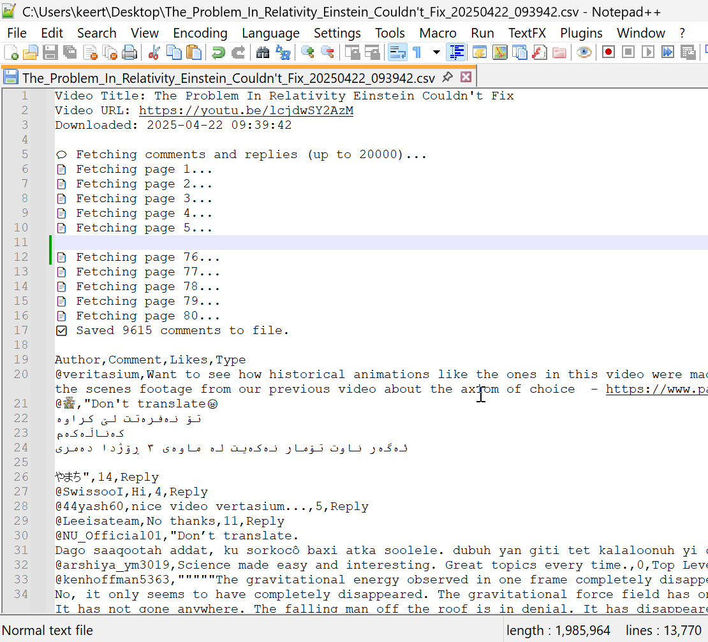

# 🎬 YouTube Comments Replies Fetcher

Extract YouTube video comments and threaded replies with metadata using the YouTube Data API — no coding required. Run it entirely on **Google Colab**, no installation needed.

---

## 🔍 Features

- ✅ Extracts up to **20,000 comments** and **replies**
- ✅ Includes **author, text, likes, type**
- ✅ Shows **fetch logs** (pages, counts)
- ✅ Outputs a clean **CSV with metadata**
- ✅ Works entirely on **Google Colab**

---

## 📦 Dependencies

- Python 3.x
- requests (auto-installed on Colab)
- Google Colab

---

## 🚀 How to Use

1. Open the notebook in [Google Colab](https://colab.research.google.com)
2. Paste your **YouTube Data API key**
3. Paste the YouTube video link
4. Get an instant CSV download with all comments + replies

---

## 📁 Output Format

The output CSV contains:

- Video metadata (title, URL, timestamp)
- Fetch logs (pages fetched)
- Columns:
  - `Author`
  - `Comment`
  - `Likes`
  - `Type` (Top Level or Reply)

---

## 🖼️ Screenshot

Here’s what the Colab output looks like after fetching comments:

---

## 📘 Example Use Cases

- Sentiment analysis on video comments
- Social media monitoring
- Audience engagement studies
- Topic modeling or clustering
- Web scraping tasks 

---

## 📄 License

MIT License 

---

## 👤 Author

[Keerthi Abe](https://www.linkedin.com/in/keerthiabe/)

---

*Built to help data science learners, content analysts, and anyone curious about YouTube communities.*
